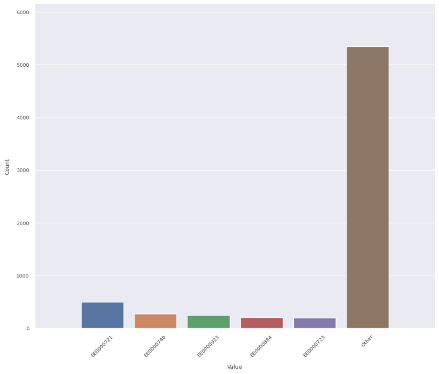
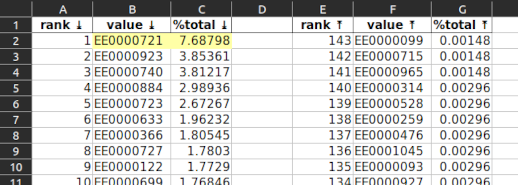

<!-- TOC start -->
- [Overview](#overview)
    * [What this program does not do](#what-this-program-does-not-do)
- [Usage](#usage)
    * [Installation](#installation)
    * [Data preparation](#data-preparation)
        - [CSV file](#csv-file)
        - [Database](#database)
            * [Environment file](#environment-file)
    * [Execution](#execution)
        - [A note about sampling](#a-note-about-sampling)
            * [How to specify sampling](#how-to-specify-sampling)
        - [Examples](#examples)
    * [Example results for restaurant data](#example-results-for-restaurant-data)
        - [score](#score)
        - [employee_id](#employee_id)
        - [activity_date](#activity_date)
        - [facility_name](#facility_name)
        - [owner_name](#owner_name)
        - [service_description](#service_description)
- [Potential improvements](#potential-improvements)
<!-- TOC end -->

<!-- TOC -->
# Overview
The idea for this code came from my time managing a team of data analysts for an internal audit department of a large company.

The audit team asks the business for certain data and, depending on the prevailing politics of the organization, may eventually receive such data or the permission necessary to extract it.

So, now you've got potentially a lot of data ... where do you tell your auditors to focus? Wouldn't it be helpful to have a program which quickly identifies interesting things? And by interesting I mean either likely incorrect, or likely correct but pointing to a business failure.

That's what this program does.

<!-- TOC -->
## What this program does not do

This is not artificial intelligence or machine learning. It _is_ useful statistics which allows a subject-matter expert, or even a well-read person, to quickly spot potential anomalies in a set of data which is otherwise too large to comprehend.

The anomalies can be incorrect measurements or evidence of a process which is not working as designed or expected. Follow-up, in the form of questions to the data producer, or to the owner or administrator of the underlying process, will likely be required.

<!-- TOC -->
# Usage

<!-- TOC -->
## Installation
- `git clone https://github.com/jsf80238/data_profiling.git`
- `cd data_profiling`
- `python3 -m venv your_dir`
- `source your_dir/bin/activate`  # or on Windows `your_dir\Scripts\activate.bat`
- `pip install -r requirements.txt`

<!-- TOC -->
## Data preparation

<!-- TOC -->
### CSV file
Download to a suitable location.

<!-- TOC -->
### Database
The program will theoretically support any database with a JDBC driver.
PostgreSQL and Microsoft SQL drivers are included.
To support another database:
- Download the JDBC driver to `data_profiling/lib/jars`.
- Edit `config\config.yaml`:
  - Add the port number.
  - Add the JDBC class name.
  - Add the name of the JDBC jar file.
  - Add the connection string.

<!-- TOC -->
#### Environment file
You can store your connection credentials in a file or provide them via the command-line.

    $ cat /tmp/env

    HOST_NAME=localhost

    PORT_NUMBER=1433
    DATABASE_NAME=master
    USER_NAME=sa
    PASSWORD=your-password

    # PORT_NUMBER=5432
    # DATABASE_NAME=example
    # USER_NAME=postgres
    # PASSWORD=your-password

<!-- TOC -->
## Execution

    $ export PYTHONPATH="data_profiling:"  # PowerShell:  $env:PYTHONPATH="data_profiling;"

    $ python data_profiling/profile-data.py -h
    usage: profile-data.py [-h] [--db-host-name HOST_NAME] [--db-port-number PORT_NUMBER]
                           [--db-name DATABASE_NAME] [--db-user-name USER_NAME]
                           [--db-password PASSWORD] [--environment-file /path/to/file]
                           [--header-lines NUM] [--sample-rows-file NUM]
                           [--max-detail-values NUM] [--max-pattern-length NUM]
                           [--output-dir /path/to/dir] [-v | -t]
                           /path/to/input_data_file.csv | query-against-database

    Profile the data in a database or CSV file. Generates an analysis consisting of an Excel
    workbook and (optionally) one or more images. For string columns provides a pattern
    analysis with C replacing letters, 9 replacing numbers, underscore replacing spaces, and
    question mark replacing everything else.

    positional arguments:
      /path/to/input_data_file.csv | query-against-database

    options:
      -h, --help            show this help message and exit
      --db-host-name HOST_NAME
                            Overrides HOST_NAME environment variable. Ignored when getting data
                            from a file.
      --db-port-number PORT_NUMBER
                            Overrides PORT_NUMBER environment variable. Ignored when getting
                            data from a file.
      --db-name DATABASE_NAME
                            Overrides DATABASE_NAME environment variable. Ignored when getting
                            data from a file.
      --db-user-name USER_NAME
                            Overrides USER_NAME environment variable. Ignored when getting data
                            from a file.
      --db-password PASSWORD
                            Overrides PASSWORD environment variable. Ignored when getting data
                            from a file.
      --environment-file /path/to/file
                            An additional source of database connection information. Overrides
                            environment settings.
      --header-lines NUM    When reading from a file specifies the number of rows to skip for
                            header information. Ignored when getting data from a database.
                            Default is 0. (must be in range 1..=9223372036854775807)
      --sample-rows-file NUM
                            When reading from a file randomly choose this number of rows. If
                            greater than or equal to the number of data rows will use all rows.
                            Ignored when getting data from a database. (must be in range
                            1..=9223372036854775807)
      --max-detail-values NUM
                            Produce this many of the top/bottom value occurrences, default is
                            35. (must be in range 1..=9223372036854775807)
      --max-pattern-length NUM
                            When segregating strings into patterns leave untouched strings of
                            length greater than this, default is 50. (must be in range
                            1..=9223372036854775807)
      --output-dir /path/to/dir
                            Default is the current directory. Will make intermediate
                            directories as necessary.
      -v, --verbose
      -t, --terse

<!-- TOC -->
### A note about sampling
If your task is to write code which [ETLs](https://en.wikipedia.org/wiki/Extract,_transform,_load) account data for a financial institution then sampling may not be an option ... your code needs to handle every source row it encounters.

For analysis tasks, though, the [Central Limit Theorem](https://www.statisticshowto.com/probability-and-statistics/normal-distributions/central-limit-theorem-definition-examples/) provides really useful results from what intuitively may seem like a small amount of data. See my [StackExchange question](https://math.stackexchange.com/questions/4023389/what-size-sample-do-i-need-to-find-errors-with-a-certain-amount-of-confidence) for a discussion.

<!-- TOC -->
#### How to specify sampling
- CSV file
  - Use the `--sample-rows-file` option. This will be an absolute number, rather than a percentage, because the confidence interval for a sample is based on the absolute number of rows, not the size of the population. If your file contains fewer rows than the number you specify the program will just analyze every row.
- Database
  - Use your database's sampling keyword.
    - For PostgreSQL see `TABLESAMPLE` and `tsm_system_rows`.
    - For Microsoft SQL see `TABLESAMPLE`.

<!-- TOC -->
### Examples

    # CSV file
    $ python data_profiling/profile-data.py /path/to/data.csv

    # CSV file, no more than 10,000 rows, set the output directory
    $ python data_profiling/profile-data.py --samp=10000 --out=/path/to/a/dir /path/to/data.csv

    # Database with connection information in command line
    $ python data_profiling/profile-data.py --db-host=https://domain.com --db-port=5432 \
    --db-name my_database --db-user=me --db-pass=my_password \
    "select * from schema_name.table_name where columnA = 3"

    # Database with more-than-default detail values and connection information in an environment file
    $ python data_profiling/profile-data.py --max-detail=40 --env=/path/to/env/file \
    "select columnA, columnC, columnJ from table_name"

<!-- TOC -->
## Example results for restaurant data
The results will be an `.zip` archive in your current directory.

The results posted below are based on Los Angeles restaurant inspection data I downloaded from https://www.kaggle.com.
The URL at that time was https://www.kaggle.com/datasets/cityofLA/la-restaurant-market-health-data.

The program generates a zip file containing:
- Excel workbook containing multiple sheets:
  - Summary.
  - A detail analysis sheet and a pattern analysis sheet for each string column in the data source.
  - Distribution plots for each date and numeric column in the data source.

This is an example summary:

Let's focus on the highlighted cells.
- C6, C19: these are likely data quality issues. As a percentage of the total data set can be ignored.
- F2: `serial_number` is unique. Good.
- G4: The most common `facility_name` for restaurants is "DODGER_STADIUM". That's odd.
- G16: And yet the most common `owner_name` is Ralph's Grocery CO. Probably https://www.ralphs.com/.
- L4: The shortest `facility_name` is "ZO". Probably a data quality issue.
- M3, Q3: Dates are treated as numeric. They can essentially be thought of as the number of seconds after some date. See also https://www.epochconverter.com/ for Linux. Windows has a [similar concept](https://devblogs.microsoft.com/oldnewthing/20090306-00/?p=18913).
- N5, O5, P5: 50% of the scores were between 91 and 96.
- M7, M18: the program treats numbers as measurements, even though for these columns the numbers are just IDs. Perhaps more sophisticated code could do better.

Now, details by column.
<!-- TOC -->
### score

- As a first estimate I would have guessed this would look like a Bell curve, perhaps with a bit of [skew](https://www.itl.nist.gov/div898/handbook/eda/section3/eda35b.htm).
- Instead, we many more scores of 90 than expected and much fewer scores of 89 than expected (and fewer in the 80s than expected).
- Without proof I would guess:
  - A score of 90-100 yields a sign in the restaurant window with the letter A.
  - A score of 80-89 yields a sign in the restaurant window with the letter B.
  - People don't like to eat at restaurants which fail to achieve an A-rating.
  - Restaurant owners, and to a lesser extent restaurant inspectors, strive to avoid anything other than an A-rating. (Image below courtesy of https://la.eater.com/2015/8/19/9178907/la-county-health-department-restaurant-grades-need-overhaul.)

<!-- TOC -->
### employee_id

- One employee (EE0000721) among the 143 who performed inspections handled one out of every fourteen inspections. And it was twice as many as the next busiest inspector. Why?

<!-- TOC -->
### activity_date

- Note the dates with very few inspections (F2, F3, F4 ...). These are Saturdays and Sundays. It makes sense inspectors (city staff) don't work as much on weekends.

<!-- TOC -->
### facility_name

- Again, "DODGER STADIUM" leads the way. Are there more restaurants in Dodger Stadium than there are Subway restaurants in all of Los Angeles?

<!-- TOC -->
### owner_name

- Note the yellow-highlighted cells. This looks to be a data-quality issue ... Levy Premium Food listed twice. When added together this would be the top owner, not Ralph's.
- Note the blue-highlighted cells. Is true there are only 50% more Starbucks than Whole Foods?

<!-- TOC -->
### service_description

- Only 1.65% of inspections were initiated by the owner. Probably makes sense.
- All inspections are some variation of "routine", apparently.

<!-- TOC -->
# Potential improvements
- Generate better plots. It is difficult to generate useful plots.
  - For example, you might want a categorical plot for character data, but if the column contains customer names then every name will appear (roughly) one time.
  - Or, you might want a histogram for numeric or datetime data, but if the column is a primary key, or a created timestamp generated by a trigger, then again each value will appear (almost always) one time.
  - Allow specification of plot visual effects.
- When reading from a file:
  - Allow the specification of unusual, but known, datetime formats.
  - Allow the specification of columns to exclude, or include.
